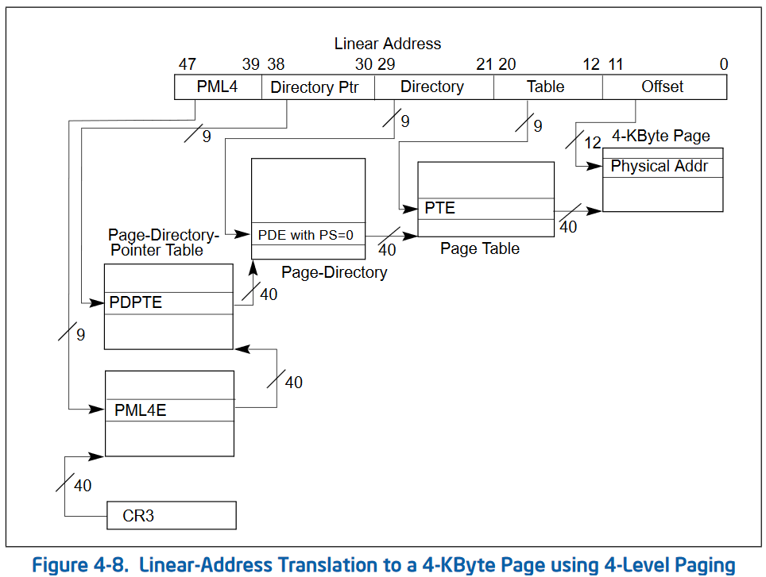
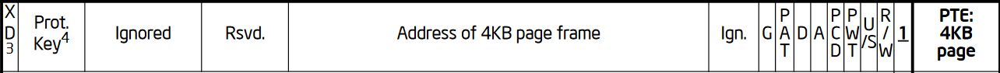
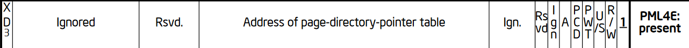
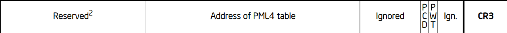

# ページング

ページングは、リニアアドレスから物理アドレスへの変換を行う機構である。
x86_64アーキテクチャではセグメンテーションでのメモリ管理ができないため、ページングでのメモリ管理を行う必要がある。

## リニアアドレス

リニアアドレスとは、セグメンテーションによって論理アドレスから変換されたアドレスである。

```
　　　　　　セグメンテーション　　　　　　　　ページング
論理アドレスーーーーーーーーー＞リニアアドレスーーーーー＞物理アドレス
```

という変換がされる。

## ページングモード

インテルのアーキテクチャには3つのページングモードがある。

- 32-bit paging
- PAE paging
- 4-level paging

Linuxなどで用いられているのは4-level pagingである。

### 4-level paging

- `CR0.PG=1`
- `CR4.PAE=1`
- `IA32_EFER.LME=1`

とフラグを立てると4-level pagingが有効になる。
ページサイズは4KB,2MB,1GBが対応している。

フラグの立て方であるが、`PAE`と`LME`を立ててから`PG`を立てることに注意。
順番を守らないと#GPが発生する。

## hierarchcal paging structure

ページングを管理するために、階層的なデータ構造を構築する必要がある。

4-level pagingの例をとると、各データ構造は512エントリを持っており、9bitずつの変換を行う。
1つ目のデータ構造は47:39bitを変換し、2つ目のデータ構造は38:30bitを変換し、3つ目のデータ構造は29:21bitを変換し、4つ目のデータ構造は20:12bitを変換する。
これより、11:0bitの変換は行われないため、ページングでは4KB単位で管理と変換が行われることになる。

## データ構造の詳細

以下に4-level pagingの詳細を示す。
次の図はSDMから抜粋したもの。



図を見るとデータ構造が`PML4`,`Page-Directory-Pointer Table`,`Page-Directory`,`Page Table`,`4-KByte Page`の5つある。
`4-KByte Page`から説明をしていく。

## `4-KByte Page`

`4-KByte Page`は物理アドレスを4KBずつに区切ってひとまとまりで管理するものである。

物理アドレスを4KBごとに区切ったものをページと呼ぶ。
物理アドレス上にはページが大量にあることになる。

1つのページの中の具体的なアドレス、例えば`0xffffabc4`を参照したいときには、フレームとオフセットというものを用いて計算する。

### ページフレーム

フレームというのは**ページの開始アドレス**のことである。
あるアドレスにアクセスしたいときには、まずどのページにあるかを指定する。

ページフレームはどこで指定するかというと、それは後述する`Page Table`というデータ構造である。
もちろんページの開始アドレスは4KBにアラインされている。

`0xffffabc4`にアクセスする際は、フレームは`0xffffa000`である。

### オフセット

どのページにアクセスしたいアドレスがあるか指定したら、次はそのページの先頭からどこにアクセスしたいアドレスがあるのかを指定する必要がある。
オフセットというのは**ページの開始アドレスからどれだけ進んだアドレスか**を表す数値である。

オフセットはどこで指定するかというと、これはリニアアドレスの下位12bitである。
オフセットはアラインされていない。

`0xffffabc4`にアクセスする際は、オフセットは`0x00000bc4`である。

## `Page Table`

`Page Table`は以下のデータ構造のテーブルである。



物理アドレス上にページは大量に並んでいるので、例えば256個のページを指定するためには上記のデータ構造が256個必要である。
`Page Table`は512個のページをまとめて管理するテーブルであるといえる。

4KBにアラインされた位置に配置しないと正しく動かないので気を付ける。

### Address of 4KB page frame

これは前述したページフレームである。
フレームが`0xffffa000`と計算されたなら、`0xffffa`を該当箇所のビットにおしこめる。

下位12bitは様々なフラグである。
SDMを読んで適切に設定しよう。

## `Page-Directory`

`Page Table`で512個のページを管理できるが、それ以上のページを管理しようと思ったら`Page-Directory`が必要である。
`Page-Directory`は512個の`Page Table`をまとめて管理するテーブルである。
データ構造は以下の通り。


4KBにアラインされた位置に配置しないと正しく動かないので気を付ける。

### Address of page table

これは前述した`Page Table`の先頭アドレスである。
先頭アドレスが`0xabcde000`と計算されたなら、`0xabcde`を該当箇所のビットにおしこめる。
(`Page Table`の先頭アドレスは4KBにアラインされていることを思い出す)

下位12bitは様々なフラグである。
SDMを読んで適切に設定しよう。

## `Page-Directory-Pointer Table`

`Page-Directory`で512個の`Page Table`を管理できるが、それ以上の`Page Table`を管理しようと思ったら`Page-Directory-Pointer Table`が必要である。
`Page-Directory-Pointer Table`は512個の`Page-Directory`をまとめて管理するテーブルである。

4KBにアラインされた位置に配置しないと正しく動かないので気を付ける。
データ構造は以下の通り。


### Address of page directory

これは前述した`Page-Directory`の先頭アドレスである。
先頭アドレスが`0xbcdef000`と計算されたなら、`0xbcdef`を該当箇所のビットにおしこめる。
(`Page-Directory`の先頭アドレスは4KBにアラインされていることを思い出す)

下位12bitは様々なフラグである。
SDMを読んで適切に設定しよう。

## `PML4`

`Page-Directory-Pointer Table`で512個の`Page-Directory`を管理できるが、それ以上の`Page-Directory`を管理しようと思ったら`PML4`が必要である。
`PML4`は512個の`Page-Directory-Pointer Table`をまとめて管理するテーブルである。

4KBにアラインされた位置に配置しないと正しく動かないので気を付ける。
データ構造は以下の通り。



### Address of page-directory-pointer table

これは前述した`Page-Directory-Pointer Table`の先頭アドレスである。
先頭アドレスが`0x12345000`と計算されたなら、`0x12345`を該当箇所のビットにおしこめる。
(`Page-Directory-Pointer Table`の先頭アドレスは4KBにアラインされていることを思い出す)

下位12bitは様々なフラグである。
SDMを読んで適切に設定しよう。

## `CR3`レジスタ

`PML4`テーブルの開始アドレスをCPUに伝える役割を持つのが`CR3`レジスタである。
データ構造は以下のとおりである。



### Address of PML4 Table

これは前述した`PML4 Table`の先頭アドレスである。
先頭アドレスが`0x12345000`と計算されたなら、`0x12345`を該当箇所のビットにおしこめる。
(`PML4 Table`の先頭アドレスは4KBにアラインされていることを思い出す)

下位12bitは様々なフラグである。
SDMを読んで適切に設定しよう。

# 実際にコードを書いてみる

ページテーブルを構築するコードは以下の通り。

```c
#include <stdint.h>
#define PML4_NUM        1
#define PD_NUM          16
#define TABLE_SIZE      512
#define PAGE_SIZE_2M    (uint64_t)0x00200000 // 2MiB
#define PAGE_SIZE_1G    512 * PAGE_SIZE_2M // 1GiB

void create_pgtable(uint64_t *pml4_addr,
        uint64_t *pdp_addr, uint64_t *pd_addr)
{
    int i;
    // ゼロフィル
    for (i = 0; i < TABLE_SIZE; i++) {
        pml4_addr[i] = 0;
        pdp_addr[i] = 0;
    }
    for (i = 0; i < TABLE_SIZE * PD_NUM; i++) {
        pd_addr[i] = 0;
    }

    // PDのエントリをフォーマット
    for (i = 0; i < TABLE_SIZE * PD_NUM; i++) {
        pd_addr[i] = ((uint64_t)(i * PAGE_SIZE_2M) | 0x083);
    }

    // PDPのエントリにPDを登録
    // pdp[0]に&pd[0]を、pdp[1]に&pd[1]を...
    for (i = 0; i < PD_NUM; i++) {
        pdp_addr[i] = ((uint64_t)(&pd_addr[i * TABLE_SIZE]) | 0x003);
    }

    // PML4のエントリにPDPを登録
    // pml4[0]に&pdp[0]を登録するだけ
    pml4_addr[0] = ((uint64_t)(&pdp_addr[0]) | 0x003);

    return;
}
```